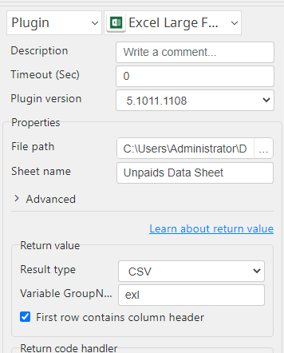
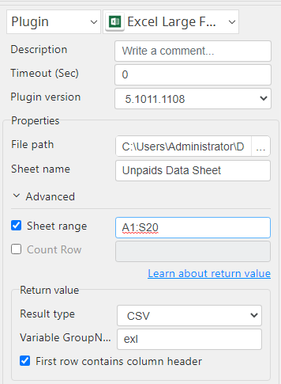
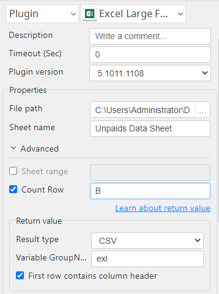

# Excel Large Files

***Excel Large Files with this plug-in read large xlsx file.***

## Excel Large Files
| Item         |               Value               |
|--------------|:---------------------------------:|
| Icon         |     |
| Display Name |       **Excel Large Files**       |

### Arun Kumar (arunk@argos-labs.com)

Arun Kumar
* [Email](mailto:arunk@argos-labs.com) 
 
## Version Control 
* [5.1011.1108](setup.yaml)
* Release Date: `October 11, 2023`

## Input (Required)
| Parameters  | Output   |
|-------------|----------|
| File path   | output   |
| Sheet name  |          |
| File path   | output   |
| Sheet name  |          |
| Sheet range |          |
| File path   | output   |
| Sheet name  |          |
| Count Row   |          |

## Return Value

### Normal Case
Description of the output result

## Return Code
| Code | Meaning                      |
|------|------------------------------|
| 0    | Success                      |
| 1    | Exceptional case             |

## Output Format
You may choose one of 3 output formats below,

<ul>
  <li>String (default)</li>
  <li>CSV</li>
  <li>File</li>
</ul>  

## Parameter setting examples (diagrams)

## Operations

### Read large excel all rows:

### Read limited rows with range:

### count no of rows in a column:

